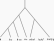

# InOutParsimony

Implementation of the InOutParsimony algorithm for solving the Small Gain-Loss Phylogeny problem.

## Command-line interface

This `in_out_parsimony` Python package provides a command-line program to run the algorithm named `inoutpars`.
After installing the package, use `inoutpars --help` for instructions.

## Input format

The `inoutpars` program reads its input tree in the NHX format.
All nodes, including all leaves and all internal nodes, must have unique names so that they can be referenced when printing solutions.
The content of leaf nodes must be specified using the NHX `contents` attribute as shown in the example below.

<table>
<tr>
<th>File <tt>data/example-rcg-7f.nhx</tt></th>
<th>Corresponding tree</th>
</tr>
<tr>
<td>
    
```nhx
(
  (
    (
      (
        1[&contents='{"b"}'],
        2[&contents='{"b","c"}']
      )A,
      3[&contents='{"b","c","e"}']
    )B,
    4[&contents='{"a","c"}']
  )C,
  (
    5[&contents='{"a","b","d"}'],
    (
      6[&contents='{"b","d","f"}'],
      7[&contents='{"b","d","f","g"}']
    )D
  )E
)F;
```

</td>
<td>

</td>
</tr>
</table>

Other examples are available in the `data/` folder.

## Citation

The following paper describes the algorithm implemented in this package.

> M. Gascon, M. Delabre, and N. El-Mabrouk, _“Gene repertoire evolution minimizing episodes of gains and losses,”_ in Comparative Genomics, M. Lafond, Ed., Cham: Springer Nature Switzerland, 2026, pp. 180–210. doi: [10.1007/978-3-032-26891-4_10](https://doi.org/10.1007/978-3-032-26891-4_10).
